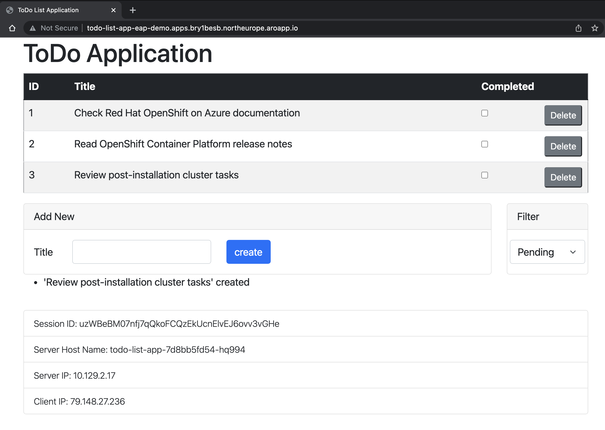

# JBoss EAP on Azure Red Hat OpenShift example

This project is a simple todo-list demo application used to walk you through the process of migrating a traditional Jakarta Faces / Jakarta Enterprise Beans / Jakarta Persistence application to a container orchestrator like Red Hat OpenShift running on Azure.

## Getting Started

### Prerequisites

> Azure Red Hat OpenShift requires a minimum of 40 cores to create and run an OpenShift cluster. The default Azure resource quota for a new Azure subscription does not meet this requirement. To request an increase in your resource limit, see [Standard quota: Increase limits by VM series](../azure-portal/supportability/per-vm-quota-requests.md). Note that the free trial subscription isn't eligible for a quota increase, [upgrade to a Pay-As-You-Go subscription](../cost-management-billing/manage/upgrade-azure-subscription.md) before requesting a quota increase.

1. Prepare a local machine with a Unix-like operating system that is supported by the various products installed (for example Red Hat Enterprise Linux 8 (latest update) in the case of JBoss EAP).
1. Install a Java SE implementation (for example, [Oracle JDK 11](https://www.oracle.com/java/technologies/downloads/#java11)).
1. Install [Maven](https://maven.apache.org/download.cgi) 3.6.3 or higher.
1. Install [Docker](https://docs.docker.com/get-docker/) for your OS.
1. Install [Azure CLI](/cli/azure/install-azure-cli) 2.29.2 or later.
1. Clone the code for this demo application (todo-list) to your local system. The demo application is at [GitHub](https://github.com/Azure-Samples/jboss-on-aro-jakartaee).
1. Follow the instructions in [Create an Azure Red Hat OpenShift 4 cluster](./tutorial-create-cluster.md).

   Though the "Get a Red Hat pull secret" step is labeled as optional, **it is required for this article**.  The pull secret enables your ARO cluster to find the JBoss EAP application images.

   If you plan to run memory-intensive applications on the cluster, specify the proper virtual machine size for the worker nodes using the `--worker-vm-size` parameter. For more information, see:

   * [Azure CLI to create a cluster](/cli/azure/aro#az_aro_create)
   * [Supported virtual machine sizes for memory optimized](./support-policies-v4.md#memory-optimized)

1. Connect to the cluster by following the steps in [Connect to an Azure Red Hat OpenShift 4 cluster](./tutorial-connect-cluster.md).
   * Follow the steps in "Install the OpenShift CLI"
   * Connect to an Azure Red Hat OpenShift cluster using the OpenShift CLI with the user `kubeadmin`

1. Execute the following command to create the OpenShift project for this demo application:

    ```bash
    $ oc new-project eap-demo
    Now using project "eap-demo" on server "https://api.zhbq0jig.northeurope.aroapp.io:6443".

    You can add applications to this project with the 'new-app' command. For example, try:

    oc new-app rails-postgresql-example

    to build a new example application in Ruby. Or use kubectl to deploy a simple Kubernetes application:

    kubectl create deployment hello-node --image=k8s.gcr.io/serve_hostname
    ```

1. Execute the following command to add the view role to the default service account. This role is needed so the application can discover other pods and form a cluster with them:

    ```bash
    $ oc policy add-role-to-user view system:serviceaccount:$(oc project -q):default -n $(oc project -q)
    clusterrole.rbac.authorization.k8s.io/view added: "system:serviceaccount:eap-demo:default"
    ```

## Demo

The demo application is a simple Jakarta EE 8 application that creates, reads, updates, and deletes records on a Microsoft SQL Server. This repository is split up into the following branches:
* `main`: Basic Jakarta EE 8 application (Jakarta Faces / Jakarta Enterprise Beans / Jakarta Persistence)
* `bootable-jar`: Basic Jakarta EE 8 application converted into a [JBoss EAP Bootable JAR](https://access.redhat.com/documentation/en-us/red_hat_jboss_enterprise_application_platform/7.4/) and using MicroProfile 4.0 specs.
* `bootable-jar-openshift`: Built on top of the bootable-jar branch, this is the application prepared to be deployed on ARO.

In the following steps, we will do a quick deployment of the Microsoft SQL server and application on ARO cluster. We will use the application code from the `bootable-jar-openshift` branch.

Please, check the full guide that uses this demo at the [Java EE, Jakarta EE, and MicroProfile on Azure](https://docs.microsoft.com/en-us/azure/developer/java/ee/) documentation.


### Deploy the database server on ARO

Execute the following steps to deploy the Microsoft SQL Server and create the database used by the application:

1. Create an OpenShift Secret object that will hold the configuration relative to the database:

   ```bash
    jboss-on-aro-jakartaee (bootable-jar-openshift) $ oc create secret generic mssqlserver-secret \
    --from-literal db-password=Passw0rd!
    secret/mssqlserver-secret created
    ```

2. Deploy the database server by executing the following:

    ```bash
    jboss-on-aro-jakartaee (bootable-jar-openshift) $ oc apply -f ./deployment/msqlserver/mssqlserver.yaml
    service/mssqlserver created
    deploymentconfig.apps.openshift.io/mssqlserver created
    persistentvolumeclaim/mssqlserver-pvc created
    ```

3. Monitor the status of the pods and wait until the database server is running:

    ```bash
    jboss-on-aro-jakartaee (bootable-jar-openshift) $ oc get pods -w
    NAME                   READY   STATUS      RESTARTS   AGE
    mssqlserver-1-deploy   0/1     Completed   0          34s
    mssqlserver-1-gw7qw    1/1     Running     0          31s
   ```

4. Connect to the database pod and create the database `todos_db`:

    ```bash
    jboss-on-aro-jakartaee (bootable-jar-openshift) $ oc rsh mssqlserver-1-gw7qw
    sh-4.4$ /opt/mssql-tools/bin/sqlcmd -S localhost -U SA -P 'Passw0rd!'
    1> CREATE DATABASE todos_db
    2> GO
    1> exit
    sh-4.4$ exit
    exit
    ```

### Deploy the application on ARO

Execute the following steps to build and deploy this demo application on ARO by using the OpenShift CLI:

1. Compile the demo application and create the Bootable JAR:

   ```bash
   jboss-on-aro-jakartaee (bootable-jar-openshift) $ MSSQLSERVER_DRIVER_VERSION=7.4.1.jre11 \
   mvn clean package -Pbootable-jar-openshift
   ```
   
2. Execute the following commands to create an application image:

   ```bash
   jboss-on-aro-jakartaee (bootable-jar-openshift) $ mkdir target/openshift && cp target/todo-list-bootable.jar target/openshift
   jboss-on-aro-jakartaee (bootable-jar-openshift) $ oc import-image ubi8/openjdk-11 --from=registry.redhat.io/ubi8/openjdk-11 --confirm
   jboss-on-aro-jakartaee (bootable-jar-openshift) $ oc new-build --strategy source --binary --image-stream openjdk-11 --name todo-list-app
   jboss-on-aro-jakartaee (bootable-jar-openshift) $ oc start-build todo-list-app --from-dir target/openshift 
   ```

3. Deploy the application and expose it:

   ```bash
   jboss-on-aro-jakartaee (bootable-jar-openshift) $ oc new-app todo-list-app \
   --env KUBERNETES_NAMESPACE=$(oc project -q) \
   --env MSSQLSERVER_PASSWORD=Passw0rd! \
   --env MSSQLSERVER_USER=sa \
   --env MSSQLSERVER_DATABASE=todos_db \
   --env MSSQLSERVER_JNDI=java:/comp/env/jdbc/mssqlds \
   --env MSSQLSERVER_HOST="\$(MSSQLSERVER_SERVICE_HOST)" \
   --env MSSQLSERVER_PORT="\$(MSSQLSERVER_SERVICE_PORT)" \
   --env JGROUPS_CLUSTER_PASSWORD=mut2UTG6gDwNDcVW
   ```

4. Expose the application through an OpenShift service:

   ```bash
   jboss-on-aro-jakartaee (bootable-jar-openshift) $ oc expose svc/todo-list-app
   ```

5. Get the public URL of the application:

   ```bash
   jboss-on-aro-jakartaee (bootable-jar-openshift) $ echo "http://"$(oc get route todo-list-app --template='{{ .spec.host }}')
   http://todo-list-app-eap-demo.apps.bry1besb.northeurope.aroapp.io
   ```

6. Open the URL with your favourite web browser. The application will look similar to the following image:

   
 
## Resources

You can learn more from references used in this guide:

* [Red Hat JBoss Enterprise Application Platform](https://www.redhat.com/en/technologies/jboss-middleware/application-platform)
* [Azure Red Hat OpenShift](https://azure.microsoft.com/services/openshift/)
* [JBoss EAP Bootable JAR](https://access.redhat.com/documentation/en-us/red_hat_jboss_enterprise_application_platform/7.4/html-single/using_jboss_eap_xp_3.0.0/index#the-bootable-jar_default)
